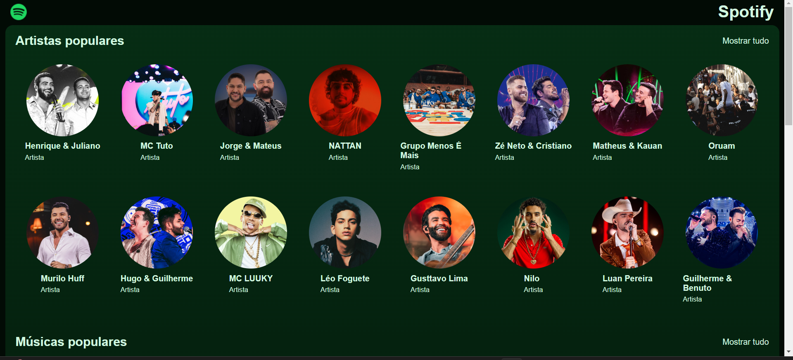

# 🎵 Spotify da Jornada Full Stack

Bem-vindo a **APi Spotify da Jornada Full Stack**! Este projeto foi desenvolvido durante a jornadada Full Strack promovida pela **Hashtag Treinamentos** entre os dias 10/02/2025 a 13/02/2025, onde exploramos tecnologias web para criar uma aplicação inspirada no Spotify.

## 📌 Sobre o Projeto

Este projeto foi desenvolvido para criar uma API de gerenciamento de músicas e artistas, utilizando **MongoDB**, **Node.js** e **Express**. Consiste em uma API simples com a funcionalidade de **CRUD (GET)** para gerenciar informações de músicas e artistas:

- 🔍 Busca de artistas
- 🎶 Exibição de playlists
- 🖼️ Exibição de detalhes do artista (imagem, nome, etc.)
- ⚡ Interface dinâmica com gerenciamento de componentes e estado utilizando React

## 🚀 Tecnologias Utilizadas

- **REACT** →  → Framework JavaScript para construir interfaces de usuário dinâmicas e componentes reutilizáveis.
- **CSS**  → Estilização da interface e layout.
- **JavaScript** → Linguagem utilizada para a lógica do projeto e interação com os componentes.
- **React Router** → Navegação entre diferentes páginas ou seções da aplicação.
Context API ou Hooks (useState, useEffect, etc.) → Gerenciamento de estado e lógica de componentes.
- **Node.js** → Plataforma para execução de JavaScript no servidor.
- **Express.js** → Framework para criar e gerenciar rotas e middleware.
- **MongoDB** → Banco de dados NoSQL utilizado para armazenar as informações.
- **CORS** → Middleware para habilitar requisições de diferentes origens.
- **VITE** → Framework usado para acelear o desenvolvimento e otimização dos builds.

## 📡 Como Executar o Projeto

1. Clone o repositório:
   ```sh
   git clone https://github.com/Audry-prog/jornada-full-stack-hashtag.git
   ```
2. Acesse a pasta **front-end** do projeto e crie os arquivos estáticos de produção:
   ```sh
   npm run dev
   ```
3. Acesse a pasta **back-end** e inicie o servidor:
   ```sh
   node ./api/server.js
   ```
Observe que será necessário rodar em 2 terminais separados, o back e o front.
Isso abrirá o projeto no seu navegador, geralmente acessando http://localhost:5173.

## 📢 Funcionalidades


- ✔️ **Busca artistas por nome**  
- ✔️ **Filtra artistas na API**  
- ✔️ **Exibe informações detalhadas do artista**  
- ✔️ **Alterna entre lista de artistas e músicas**  
- ✔️ **Estilização dinâmica baseada na interação do usuário**  
- ✔️ **Seleção de músicas por artistas**  
- ✔️ **Reprodução sonora da música**

## Print da Tela do Projeto:  



## 📜 Licença

Este projeto foi desenvolvido para fins educacionais durante a imersão da Alura. Sinta-se à vontade para explorar. 🎵🚀

---

💡 **Dúvidas ou sugestões?** Contribua com o projeto ou entre em contato! 😃